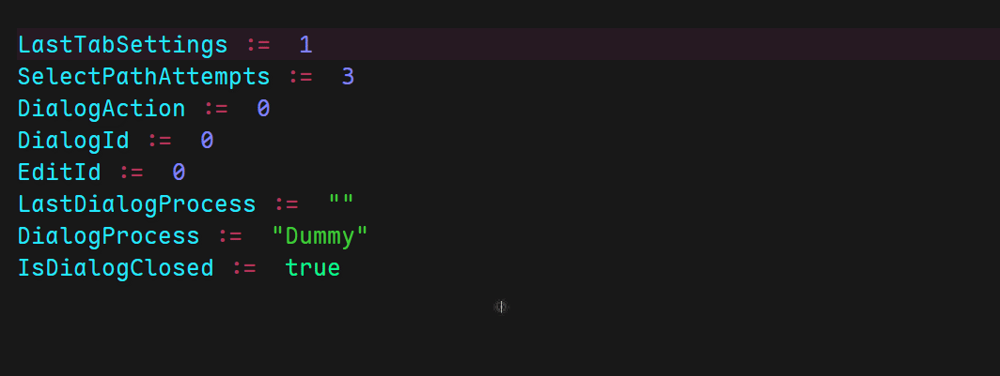

Awesome Notepad++ is a customized version of the famous text editor with various features out of the box. Write code with beautiful syntax highlighting, launch scripts and translate comments directly from Notepad++. [You can download it here](https://github.com/JoyHak/awesome-notepad-plus-plus/releases ). **For a better experience, please download the [Maple Mono NF CN](https://github.com/subframe7536/maple-font) font or [install it from the repo](MapleMono-NF-CN-Regular.ttf).**


You can always contribute to the project or add new features for yourself. [Read how customize everything and where to find configs here](#customization).

## Features

Click on any hyperlink to quickly open related paragraph about this feature. See demo in [/Images](/images).

- High-quality [syntax highlighting](#syntax) for [Autohotkey](https://www.autohotkey.com/docs/v2/Program.htm), [PowerShell](https://learn.microsoft.com/en-us/powershell/scripting/overview?view=powershell-7.5), [Xyplorer](https://www.xyplorer.com/tour.php?page=scripting), [Nilesoft Shell](https://nilesoft.org/docs), [Assembly](https://en.wikipedia.org/wiki/X86_assembly_language), [Batch](https://en.wikipedia.org/wiki/Batch_file) (and DOS). Consistent theme for other languages.

- [Auto-completion](#completion) and [code snippets](#snippets) for Autohotkey, PowerShell and Xyplorer.

  
  

  Press `Tab` to insert code snippet; press `Ctrl+L` to move caret to the next placholder (e.g. inside `try { }` block).

- [Documentation popup](#calltips) and function parameters popup.

  
  
  
  

  <a name="calltips-shortcuts"></a>
  Type `(` after function name or press `Ctrl+Shift+O` to see calltip (function parameters hint); `Ctrl+J` - next page, `Ctrl+U` - previous page. 
  Hover your mouse on function/keyword to see documentation popup; click on it to open next page.

  **Supports all languages.**

  

- [Buttons](#buttons) to build and run any scripts.

  - AutoHotkey scripts can be compiled via "compile" button if [Ahk2Exe directives](https://www.autohotkey.com/docs/v1/misc/Ahk2ExeDirectives.htm#Bin) are presented in the file. [Here's an example](https://github.com/JoyHak/QuickSwitch?tab=readme-ov-file#compiling).
    
  - Assembly x86 can be compiled automatically using bundled toolchain. 
    
  - Quick shortcuts:
    `Ctrl+Shift+A` - compile
    `Ctrl+Shift+S` - run
    `Ctrl+Shift+D` - compile and run

- [Customizable toolbar](#toolbar) with new icons.

  

  [All icons can be found here](Notepad++/plugins/Config/icons). You can [override or change them](#toolbar).

- Useful [context menu actions](#menu):

  - [Offline documentation](Notepad++/helpDocumentation) search from context menu: AutoHotkey, Xyplorer, MSDN (WinApi, useful for DllCalls).

    

  - [Translate selected text](#scripts), get alternative translation variants.

    

  - Find [magic number](#scripts) (CLSID, WinApi macro/constant, DllCall values).

    

  - Add [separators](#scripts) with text.

    

  - Align text vertically.

    

  - Change text case.

- New search/replace dialog design with bigger font

  

  Press `Ctrl+E` to search for all calls of the function under caret.
  

## Syntax highltighting

Syntax highltighting can be configured via [basic language file](Notepad++/userDefineLangs) and powerful [EnhanceAnyLexer config](Notepad++/plugins/Config/EnhanceAnyLexer/EnhanceAnyLexerConfig.ini). See demo in [/Images](/images). [Read how to configure it](#syntax).

Syntax highlighting is designed so that the most important things are slightly contrasting; negation/error throwing are bright red; operators and comments do not distract from reading; everything else is soft colors that are slightly different from each other.

#### AutoHotkey

- Negation of variables, functions, and integer expressions to quickly distinguish elements of logic algebra.

  

- Each identifier has its own unique color.

  

- Each logging level has its own color. The colors for `return` and `throw` allow you to quickly see what the function returns: an error or a value.

  
  

- You can quickly distinguish between the DllCall function and its argument types.
  

#### Xyplorer

- Labels, sub-routines (sub-scripts), user functions and built-in functions has it's own distinct smooth colors.

  

- Arguments, switches, strings and paths has it's own colors.

  
  

- You can quickly distinguish between strings, paths, booleans, and lists.

  

#### Powershell

- You can quickly distinguish between splatting, switches and named parameters.

  

- Special operators and named parameters has it's own distinct smooth colors.

  

## Customization

Everything can be configured through the intuitive interface of the installed plugins (the `Plugins` menu at the top) or through various configs, links to which are provided below. Please read the comments at the beginning of each config to understand how it works.

<a name="readable-nppexec"></a>

> [!TIP]
> To make NppExec scripts (`.exec` or `npes_saved`) readable, open them in Notepad++ and select `Language - NppExec` from the top menu.
> 
> All configs below has syntax highlighting for Notepad++. Prefer to use it over GitHub preview.

<a name="syntax"></a>

- [Internal syntax highlighting](Notepad++/userDefineLangs) of basic keywords, operators, and functions is found in the files here. *[Here](https://npp-user-manual.org/docs/user-defined-language-system/) you can read how to configure internal syntax highlighting using user-defines languages.* 

<details><summary>UDL example</summary>

```html
<NotepadPlus>
<UserLang name="AutoHotkey" ext="ahk AHK ahk2" udlVersion="2.1">
    <Settings>
        <Global caseIgnored="yes" allowFoldOfComments="yes" foldCompact="yes" forcePureLC="0" decimalSeparator="0" />
        <Prefix Keywords1="no" Keywords2="no" Keywords3="no" Keywords4="no" Keywords5="no" Keywords6="no" Keywords7="no" Keywords8="yes" />
    </Settings>
    <KeywordLists>
        <Keywords name="Operators2">?? ? + ^ ~ %</Keywords>
        <Keywords name="Keywords1">Ceil Chr Click ClipWait ClipboardAll</Keywords>
        <Keywords name="Keywords2">break false reload ExitApp exit Pause throw</Keywords>
        <Keywords name="Keywords3">super ErrorLevel true this A_AhkPath A_AhkVersion</Keywords>
        </KeywordLists>
    <Styles>
        <WordsStyle name="DEFAULT" fgColor="21E8FE" bgColor="1E1E21" colorStyle="1" fontName="Maple Mono NF CN" fontStyle="0" nesting="0" />
        <WordsStyle name="COMMENTS" fgColor="808080" bgColor="1E1E21" colorStyle="1" fontName="Maple Mono NF CN" fontStyle="0" nesting="72" />
    </Styles>
</UserLang>
</NotepadPlus>

```

</details>

- [RegEx syntax highlighting](Notepad++/plugins/Config/EnhanceAnyLexer/EnhanceAnyLexerConfig.ini) for any expression/complex keyword. *Read comments about syntax at the beginning!*

<details><summary>RegEx examples</summary>

```fsharp
// Each configured lexer must have a section with its name
//  followed by one or more lines with the syntax
//  color[optional whitelist] = regular expression.
//  A color is a number in the range 0 - 16777215.
//  Examples:

[Autohotkey]
; Functions and classes: whole word and ( or {
#6278df = \b\w+\b\.(call|bind|name)

; Logging
#abba41[4] = (?i)\b(Log\w*)\b
#ff3e33[4,8] = (?i)\b(\w*Error|(Log)?Exception|throw)\b
```

</details>

- [Theme and syntax highlighting for other languages](Notepad++/themes/Colorful%20dark.xml).

<a name="toolbar"></a>

- Toolbar buttons can be [changed and re-ordered here](Notepad++/plugins/Config/CustomizeToolbar.btn). *Read comments about syntax at the beginning.*
- All the icons [can be found here](Notepad++/plugins/Config/icons). You can [download more icons here](https://drive.google.com/drive/folders/12Zp8vIvtqpUsaJbYuWgyfNvbjYEuOzjt).

<details><summary>Toolbar example</summary>

```ini
; Each custom button definiton comprises 7 comma separated fields:
; Menu1, Submenu1, Submenu2, Submenu3, name.bmp, light.ico, dark.ico
;  
; Some fields are optional:
;   .bmp and .ico
;   after the last visible SubmenuN, the SubmenuN+1 fields become optional 
;  
; If .bmp or .ico file names are present, the files must be located 
; in the Notepad++ configuration sub-folder: ../plugins/config
;  
;  
; Quick codes can be used instead of file names: *color:label 
; A quick code comprises:
; an * followed by either a color code letter/hex color value
; label
;  
;  
; EXAMPLES
; Define custom button using file names:
Edit,Select_All,,,standard-1.bmp,fluentlight-1.ico,fluentdark-1.ico
; Redefine existing button using file names:
Plugins,Compare,Navigation_Bar,,standard-3.bmp,fluentlight-3.ico,fluentdark-3.ico
; Run and compile
Plugins,NppExec,Debug,,,icons\debug.ico
Plugins,NppExec,Compile,,,icons\compile.ico
Plugins,NppExec,Run,,,icons\run.ico
 
```

</details>

<a name="menu"></a>

- [Context menu](Notepad++/contextMenu.xml) actions are [NppExec scripts](https://github.com/d0vgan/nppexec).

<details><summary>Add new script</summary>
<br>

1. [Open NppExec scripts](Notepad++/plugins/Config/npes_saved.txt) file. [Enable syntax highlighting](#readable-nppexec).
2. Append new script. See the docs about [NppExec syntax](Notepad++/plugins/NppExec/doc/NppExec/NppExec_HelpAll.txt).
3. Open `Plugins - NppExec - Advanced Options` at the top.
4. Select your new script and press `Add`. 


5. Restart Notepad++.
6. Open [context menu config](Notepad++/contextMenu.xml) and add new script. *See other menu actions syntax*.
  <details><summary>Menu example</summary>

  ```html
        <Item FolderName="Translate"    PluginEntryName="NppExec"               PluginCommandItemName="Translate selected"              ItemNameAs="Selected"/>
        <Item FolderName="Translate"    PluginEntryName="NppExec"               PluginCommandItemName="Translation variants"            ItemNameAs="Show variants"/>
        <Item FolderName="Find magic number"    PluginEntryName="NppExec"       PluginCommandItemName="Find CLSID constant"             ItemNameAs="{CLSID} (win folder)"/>
        <Item FolderName="Find magic number"    PluginEntryName="NppExec"       PluginCommandItemName="Find shell constant"             ItemNameAs="Shell:: (internal explorer path)"/>
        <Item FolderName="Find magic number"    PluginEntryName="NppExec"       PluginCommandItemName="Find Win32 constant"             ItemNameAs="Win32/DllCall/Message/Macros"/>
  ```
  </details>
6. Restart Notepad++.

<br>
</details>

<a name="buttons"></a>

- "Run" and "Compile" buttons are configured via [NppExec scripts](Notepad++/plugins/Config/npes_saved.txt). [Read more about scripts above](#menu).
Each button launches the corresponding [extension-like script](Notepad++/plugins/Config/NppExecScripts). If the extension of the current opened file matches the name of one of the `.exec` scripts, this `.exec` script will be launched to proceed opened file. *E.g. if I am working with an `.ahk` file and I want to run it, "Run" will search for a file named `.ahk.exec` in [this directory](Notepad++/plugins/Config/NppExecScripts).*

<details><summary>Buttons scripts</summary>
  
Depending on the selected button, NppExec script will be launched with arguments. For example, the `run` button will pass the `-run` argument to the file.

```javascript
// npes_saves.txt
::Run
    set local CONFIG = $(NPP_DIRECTORY)\plugins\Config\NppExecScripts\$(EXT_PART).exec
    set exists ~ fileexists $(CONFIG)
    if $(exists) == 1 then
        NPP_EXEC $(CONFIG) -run
```

Further, these arguments can be processed in the NppExec script. It uses [goto label](https://github.com/JoyHak/awesome-notepad-plus-plus/blob/b68963e8e5155dfa6da122e82d57514221d4693c/Notepad%2B%2B/plugins/NppExec/doc/NppExec/NppExec_HelpAll.txt#L2173) because there are no functions:

```javascript
// .ahk.exec
// Jump to the label that matches the arg
goto $(ARGV)

:-run
    // Run using Windows file assoc.
    NPP_RUN "$(FULL_CURRENT_PATH)"
    exit

:-compile-run       
    :-compile
        // Kill running script & exe silently before compiling
        taskkill /f /t /im "$(NAME_PART)*"                      // .exe
        taskkill /fi "WINDOWTITLE eq $(FULL_CURRENT_PATH)*"     // .ahk

        $(COMPILER) /in "$(FILE_NAME)" /silent

        if $(ARGV) == -compile then
            exit            
        endif
     
    // Run only after success
    if $(EXITCODE) == 0 then
        set exists ~ fileexists $(OUTPUTL)
        if $(exists) == 1 then
            NPP_RUN $(OUTPUTL)
        //...
```

</details>

<a name="scripts"></a>

- Some of the [features](#features) are [NppExec scripts](Notepad++/plugins/Config/npes_saved.txt) with [additional `.ahk` helpers](Notepad++/AutoHotkey):

  - [Add separators with text](Notepad++/plugins/Config/npes_saved.txt)
  - [Find usages](Notepad++/plugins/Config/npes_saved.txt)
  - [Translate selected text](Notepad++/AutoHotkey/GetTranslation.ahk)
  - [Magic numbers](Notepad++/AutoHotkey/MagicNumbers/IniReadFuzzy.ahk)

Read [how to add new script](#menu). See [how to enable NppExec syntax highlighting](#readable-nppexec).

<details><summary>Script example</summary>
  
If you open [NppExec scripts](Notepad++/plugins/Config/npes_saved.txt), you'll see that some of them serve as wrappers to launch [AutoHotkey scripts](Notepad++/AutoHotkey). NppExec lets you add new menu items and output the message to the console. AutoHotkey lets you write complex algorithms and logic for menu items.

```javascript
::Find references
    npp_sendmsg NPPM_LAUNCHFINDINFILESDLG "$(CURRENT_DIRECTORY)" "*$(EXT_PART)"
    $(NPP_DIRECTORY)\AutoHotkey\FindReferences.exe $(CURRENT_WORD)  


::Translate selected 
    // setup stuff....
    $(NPP_DIRECTORY)\AutoHotkey\GetTranslation.exe -from "auto" -to "en" $(ARGV) "$(SELECTED_TEXT)"
    sci_sendmsg SCI_ANNOTATIONSETTEXT $(line) 0
    
    // Replace selected text with translation
    sel_settext $(OUTPUT)
                     
::Translation variants                                                             
    npp_exec "Translate selected" -variants  // pass $(ARGV) to the script above

::_find_magic_number
    $(NPP_DIRECTORY)\AutoHotkey\MagicNumbers\IniReadFuzzy.exe $(ARGV) "$(SELECTED_TEXT)"
    // replace selection.....

// pass database to script above
::Find CLSID constant
    npp_exec _find_magic_number "$(NPP_DIRECTORY)\AutoHotkey\MagicNumbers\Database\clsid.ini"

::Find shell constant
    npp_exec _find_magic_number "$(NPP_DIRECTORY)\AutoHotkey\MagicNumbers\Database\shell.ini"

::Find Win32 constant
    npp_exec _find_magic_number "$(NPP_DIRECTORY)\AutoHotkey\MagicNumbers\Database\win32.ini"
```
As you can see, [NppExec](https://github.com/d0vgan/nppexec) is very useful to manipulate arguments before running any logic. It's also very useful to retrieve information from current editor:
```javascript
    // found result will be stored in $(OUTPUT) var
    $(NPP_DIRECTORY)\AutoHotkey\MagicNumbers\IniReadFuzzy.exe $(ARGV) "$(SELECTED_TEXT)"
    
    :error
    if $(EXITCODE) != 0 then
        npp_console on
        exit
    endif
    
    // Insert the result below and comment it
    // npp_sendmsg WM_COMMAND IDM_EDIT_BLANKLINEBELOWCURRENT
    sci_sendmsg SCI_LINEENDWRAP
    sci_sendmsg SCI_NEWLINE
    
    if "$(OUTPUT1)" == "$(OUTPUTL)" then
        // One-line result
        sel_settext $(OUTPUT)
    else
        // Select inserted text
        sci_sendmsg SCI_GETSELECTIONSTART
        set sel_start = $(MSG_RESULT)
        
        sel_settext $(OUTPUT)
        
        sci_sendmsg SCI_GETSELECTIONSTART
        set sel_end = $(MSG_RESULT)
        
        sci_sendmsg SCI_SETSELECTIONSTART $(sel_start)
        sci_sendmsg SCI_SETSELECTIONEND $(sel_end)
    endif

    // comment region
    npp_sendmsg WM_COMMAND IDM_EDIT_BLOCK_COMMENT
    
    // Restore selection
    sci_sendmsg SCI_SETSELECTIONSTART $(original_sel_start)
    sci_sendmsg SCI_SETSELECTIONEND $(original_sel_end)
```


</details>

<a name="completion"></a>

- [Auto-completetion dir](Notepad++/autoCompletion) contains files with docs/syntax/parameters for each function, command or keyword. Each `.xml` file will be used to display auto-completion menu, calltip (function hint) and docs popup ([see demo here](#calltips-shortcuts)). [Read about schema and syntax here](https://npp-user-manual.org/docs/auto-completion).

<details><summary>Schema</summary>

Each `<KeyWord>` can contain different structure.

### 1. Function

Function is `<KeyWord>` tag with `func="yes"` atrribute. It can contain 1+ `<Overload>` tags with 1+ `<Param>` tags:

```html
        <!-- signature: {Func} GetMethod(Value, [Name], [ParamCount]) -->
        <KeyWord name="GetMethod" func="yes">
            <!-- Page 1: signature, brief description -->
            <Overload retVal="{Func}" descr="Retrieves the implementation function of a method.">
               <Param name="Value"/>   <!-- required -->
               <Param name="[Name]"/>  <!-- optional -->
               <Param name="[ParamCount]"/>  <!-- optional -->
            </Overload>   
            <!-- Page 2: same signature (same <param> tags), detailed description -->
            <Overload retVal="{Func}" descr="Can be used to check if Name is the function:
IsFunc(callback) => GetMethod(callback)

If the function/method is not found or cannot be retrieved 
without invoking a property getter,  
a MethodError is thrown.">
               <Param name="Value"/>
               <Param name="[Name]"/>
               <Param name="[ParamCount]"/>
            </Overload>
        </KeyWord>
        <!-- 2 pages total -->
```

Each `<Overload>` tag essentially represents a page. Users can switch the page using the `Ctrl+J/U` shortcut or by [clicking on the documentation pop-up window](#calltips-shortcuts). If you have a single large `<Overload>` tag, it may not fit on the user's screen, so it's best to split long *overloads* into multiple tags. 

**A rule of thumb:**
- the 1st page is for *params* (the function signature) and a brief description;<br>
- the 1nd page is for detailed information;<br>
- the remaining pages are for various types of information about the function.<br>

  <details><summary>Example</summary>
  
  ```html
          <KeyWord name="ControlClick" func="yes">
             <!-- Page 1: long signature, brief description. -->
             <!-- Detailed description and long signature may not fit into the screen!  -->
              <Overload retVal="" descr="Sends a mouse button or mouse wheel event to a control.">
                 <Param name="[ControlOrPos]"/>
                 <Param name="[WinTitle]"/>
                 <Param name="[WinText]"/>
                 <Param name="[Button]"/>
                 <Param name="[ClickCount]"/>
                 <Param name="[Options]"/>
                 <Param name="[NotInTitle]"/>
                 <Param name="[NotInText]"/>
              </Overload>
              <!-- Page 2: same signature (same <param> tags), detailed description -->
              <Overload retVal="" descr="Control-or-pos:
      ControlClick 'x100 y200', ...
      ControlClick Var, ... (where Var is ClassNN, text, HWND, or an obj with 'hwnd' property)
  Button: 
    Left (L), Right (R), Middle (M), X1, X2, WheelUp (WU), WheelDown (WD)
  
  ClickCount: 
    Default = 1
  
  Options:
   NA = possible reliability improvement
    D = press and hold mouse button
    U = release specified mouse button
  Pos = use only 'x y' for Control-or-pos param
   Xn = where to click, relative to control top left (default is center)
   Yn = where to click, relative to control top left (default is center)">
                 <Param name="[ControlOrPos]"/>
                 <Param name="[WinTitle]"/>
                 <Param name="[WinText]"/>
                 <Param name="[Button]"/>
                 <Param name="[ClickCount]"/>
                 <Param name="[Options]"/>
                 <Param name="[NotInTitle]"/>
                 <Param name="[NotInText]"/>
              </Overload>
          </KeyWord>
        <!-- 2 pages total -->
        <!-- retVal="" means "returns nothing", i.e. {Void} function -->
  ```
  
  </details>


If a function accepts only one set of parameters, such as `ControlClick` in example above, **you must duplicate the `<param>` tag in all `<Overload>` tags! Otherwise, each page will contain a different set of parameters—that is, different function signatures—which can confuse the reader.

It’s better to specify the return value (if any) in the `retVal` attribute:

```html
        <KeyWord name="DateAdd" func="yes">
            <Overload retVal="{Date}" descr="Adds or subtracts time from a date-time value.">
               <Param name="DateTime"/>
               <Param name="Time"/>
               <Param name="TimeUnits"/>
            </Overload>
            <Overload retVal="{Date}" descr=" DateTime = YYYYMMDDHH24MISS format
     Time = Integer or float.
TimeUnits = Seconds (S), Minutes (M), Hours (H), Days (D)
Year (if used) must be on or after 1601.">
               <Param name="DateTime"/>
               <Param name="Time"/>
               <Param name="TimeUnits"/>
            </Overload>
        </KeyWord>
```

Each `<Overload retVal="{Date}"...` should display consistent function signature: `{Date} DateAdd(DateTime, Time, TimeUnits)` on each page.

Functions may have different sets of optional parameters, and the description varies depending on these parameters.
  
  <details><summary>Example</summary>
  
  ```html
            <KeyWord name="IniRead" func="yes">
                <Overload retVal="{String}" descr="Reads a value from a standard format .ini file.">
                <Param name="Filename"/>
                <Param name="Section"/>
                <Param name="Key"/>
                <Param name="[Default]"/>
                </Overload>
                <Overload retVal="{String}" descr="Reads a section from a standard format .ini file.">
                <Param name="Filename"/>
                <Param name="Section"/>
                <Param name="[Default]"/>
                </Overload>
                <Overload retVal="{String}" descr="Reads a list of section names from a standard format .ini file.">
                <Param name="Filename"/>
                <Param name="[Default]"/>
                </Overload>
            </KeyWord>
            <KeyWord name="IniWrite" func="yes">
                <Overload retVal="" descr="Writes a value to the .ini file.">
                <Param name="Value"/>
                <Param name="Filename"/>
                <Param name="Section"/>
                <Param name="Key"/>
                </Overload>
                <Overload retVal="" descr="Overwrites section in the .ini file.">
                <Param name="Value"/>
                <Param name="Filename"/>
                <Param name="Section"/>
                </Overload>
                <Overload retVal="" descr="Can be used to create a shortcut to a URL (instead of FileCreateShortcut):
    IniWrite('https://www.google.com', 'C:\My Shortcut.url', 'InternetShortcut', 'URL')
    
    The following may be optionally added to assign an icon to the above:
    IniWrite(&gt;IconFile&gt;,  'C:\My Shortcut.url', 'InternetShortcut', 'IconFile')
    IniWrite(&gt;IconIndex&gt;, 'C:\My Shortcut.url', 'InternetShortcut', 'IconIndex')  
    Replace &gt;IconIndex&gt; with the index of the icon (0 is the first icon). 
    
    Replace &gt;IconFile&gt; with a URL, EXE, DLL, or ICO file. 
    Examples = 
    'C:\Icons.dll' 
    'C:\App.exe'
    'https://www.somedomain.com/ShortcutIcon.ico'">
                <Param name="Target"/>
                <Param name="LinkFile"/>
                <Param name="Section"/>
                <Param name="Key"/>
                </Overload>
            </KeyWord>
  ```
  
  </details>

### Keyword with Description

You can specify keyword the will be visible in auto-completion list after typing its name; in docs popup after mouse hover. Just specify `<Keyword> ` tag with `func="no"` attribute.

```html
        <KeyWord name="for" func="no">
            <Overload retVal="" descr="
Repeats one or more statements once for each key-value pair in an object.
for value in &lt;expression&gt; {
    ...
}

-- OR --

for index , value in &lt;expression&gt; {
    ...
}
        </KeyWord> 
```
Description will be displayed in docs popup only! It is best to avoid using leading spaces and tabs at the beginning of lines (like, for example, in the continuation section in AutoHotkey), since they are not removed from docs popup, which may break description appearance.

### Keyword Only

This type of keywords will be displayed in auto-completion list only.

```html
        <KeyWord name="local"/>
        <KeyWord name="global"/>
        <KeyWord name="static"/>
```

</details>

  <a name="calltips"></a>
  Documentation popup is done via [Python script](Notepad++/plugins/Config/PythonScript/scripts/calltips.py).
  <a name="snippets"></a>
  Auto-completion menu also includes [code snippets](Notepad++/plugins/Config/QuickText.ini). Open `Plugins - QuickText - Settings` to add new snippet.

<details><summary>Details</summary>
The dollar sign `$` is a placeholder for the cursor after a code snippet is applied. Press `Ctrl+L` to move the cursor to the next placeholder. *For user-defined languages (UDFs), such as AutoHotkey or PowerShell, you must use only section `[15]`! You cannot define separate code snippets for user-defined languages.

```ini
[15]
#LANGUAGE_NAME=udf
addresource-ahk2exe=;@Ahk2Exe-AddResource $\n
astr-dllcall='AStr', $
base-ahk2exe=;@Ahk2Exe-Base $\n
base-exe-ahk2exe=;@Ahk2Exe-Base $, $\n
blind-send='{Blind}$'
case=case $:\n	$
catch=catch {\n	$\n}
catch-as=catch $ as $ {\n	$\n}
```

</details>

## Why Notepad++

VSCode is quite popular, but it uses the Electron framework, which is written in high-level JavaScript. In fact, it is a small browser that weights hundred megabytes. It feels slow and heavy.

Notepad++ is written entirely in C++. It is low-level (compiled) the language that makes Notepad++ fast and compact. It is very useful on weak machines and laptops.

The main drawback of Notepad++ is its out-of-the-box appearance: it doesn't look as attractive as VSCode, it doesn't have the necessary plugins and powerful syntax highlighting. I tried to solve these problems and give every programmer the tools that Notepad++ lacks so much.
